# Database Diagram — OUI System

Diagrama ER completo do sistema, agrupado por modulo para guiar a modularizacao (Issue #51).

## Diagrama ER (Mermaid)

```mermaid
erDiagram
    %% ═══════════════════════════════════════
    %% AUTH / RBAC MODULE
    %% ═══════════════════════════════════════

    UserEntity {
        long Id PK
        guid ExternalId UK
        string Email UK
        string PasswordHash
        string DisplayName
        datetime CreatedOn
    }

    RoleEntity {
        long Id PK
        guid ExternalId UK
        string Name UK
        string Description
        bool IsSystemRole
    }

    PermissionEntity {
        long Id PK
        guid ExternalId UK
        string Name UK
        string Category
        string Description
    }

    UserRoleEntity {
        long Id PK
        long UserId FK
        long RoleId FK
        datetime AssignedOn
        string AssignedBy
    }

    RolePermissionEntity {
        long Id PK
        long RoleId FK
        long PermissionId FK
        datetime GrantedOn
        string GrantedBy
    }

    UserEntity ||--o{ UserRoleEntity : "has roles"
    RoleEntity ||--o{ UserRoleEntity : "assigned to users"
    RoleEntity ||--o{ RolePermissionEntity : "has permissions"
    PermissionEntity ||--o{ RolePermissionEntity : "granted to roles"

    %% ═══════════════════════════════════════
    %% INVENTORY MODULE
    %% ═══════════════════════════════════════

    SupplierEntity {
        long Id PK
        guid ExternalId UK
        string Name
        string Email
        string PhoneNumber
        string TaxNumber
        string Initial UK
        string Notes
        decimal CreditPercentageInStore
        decimal CashRedemptionPercentage
    }

    BrandEntity {
        long Id PK
        guid ExternalId UK
        string Name
        string Description
        string LogoUrl
    }

    CategoryEntity {
        long Id PK
        guid ExternalId UK
        string Name
        string Description
        long ParentCategoryId FK "nullable self-ref"
    }

    TagEntity {
        long Id PK
        guid ExternalId UK
        string Name UK
        string Color "hex #RRGGBB"
    }

    ReceptionEntity {
        long Id PK
        guid ExternalId UK
        long SupplierId FK
        datetime ReceptionDate
        int ItemCount
        ReceptionStatus Status "Pending|Evaluated|Created"
        string Notes
        datetime EvaluatedAt
        string EvaluatedBy
    }

    ItemEntity {
        long Id PK
        guid ExternalId UK
        string IdentificationNumber UK "M202602-0001"
        string Name
        string Description
        long BrandId FK
        long CategoryId FK "nullable"
        string Size
        string Color
        string Composition
        ItemCondition Condition
        decimal EvaluatedPrice
        decimal CostPrice "own-purchase only"
        decimal FinalSalePrice
        decimal CommissionPercentage "default 50"
        decimal CommissionAmount
        ItemStatus Status "lifecycle enum"
        AcquisitionType AcquisitionType "Consignment|OwnPurchase"
        ItemOrigin Origin
        long SupplierId FK "nullable"
        long ReceptionId FK "nullable"
        long SaleId FK "nullable"
        long SupplierReturnId FK "nullable"
        bool IsRejected
        string RejectionReason
        datetime ReturnedAt
        datetime SoldAt
        int DaysInStock
    }

    ItemPhotoEntity {
        long Id PK
        guid ExternalId UK
        long ItemId FK
        string FileName
        string FilePath
        string ThumbnailPath
        int DisplayOrder
        bool IsPrimary
    }

    SupplierReturnEntity {
        long Id PK
        guid ExternalId UK
        long SupplierId FK
        datetime ReturnDate
        int ItemCount
        string Notes
    }

    ReceptionApprovalTokenEntity {
        long Id PK
        guid ExternalId UK
        long ReceptionId FK
        string Token UK
        datetime ExpiresAt
        datetime ApprovedAt
        string ApprovedBy
        bool IsUsed
    }

    ConsignmentItemEntity {
        long Id PK
        guid ExternalId UK
        string IdentificationNumber
        string Name
        decimal EvaluatedValue
        ConsignmentItemStatus Status
        long ConsignmentId FK "nullable"
        long SupplierId FK "nullable"
    }

    SupplierEntity ||--o{ ReceptionEntity : "receives items"
    SupplierEntity ||--o{ ItemEntity : "consigns items"
    SupplierEntity ||--o{ SupplierReturnEntity : "items returned to"
    ReceptionEntity ||--o{ ItemEntity : "contains"
    ReceptionEntity ||--o{ ReceptionApprovalTokenEntity : "approval tokens"
    BrandEntity ||--o{ ItemEntity : "brand of"
    CategoryEntity ||--o{ ItemEntity : "categorizes"
    CategoryEntity ||--o{ CategoryEntity : "parent/child"
    ItemEntity ||--o{ ItemPhotoEntity : "has photos"
    ItemEntity }o--o{ TagEntity : "tagged with (M:M ItemTags)"
    SupplierReturnEntity ||--o{ ItemEntity : "returned items"

    %% ═══════════════════════════════════════
    %% SALES MODULE (POS + Financial merged)
    %% ═══════════════════════════════════════

    CashRegisterEntity {
        long Id PK
        guid ExternalId UK
        string OperatorUserId
        string OperatorName
        string RegisterNumber
        datetime OpenedAt
        datetime ClosedAt
        decimal OpeningAmount
        decimal ClosingAmount
        decimal ExpectedAmount
        decimal Discrepancy
        string DiscrepancyNotes
        CashRegisterStatus Status
    }

    SaleEntity {
        long Id PK
        guid ExternalId UK
        string SaleNumber UK
        long CashRegisterId FK
        string CustomerId "nullable"
        datetime SaleDate
        decimal Subtotal
        decimal DiscountPercentage
        decimal DiscountAmount
        decimal TotalAmount
        string DiscountReason
        SaleStatus Status "Active|Voided|PartialReturn|FullReturn"
        string Notes
    }

    SaleItemEntity {
        long Id PK
        long SaleId FK
        long ItemId FK
        decimal UnitPrice
        decimal DiscountAmount
        decimal FinalPrice
        long SettlementId FK "nullable"
    }

    SalePaymentEntity {
        long Id PK
        long SaleId FK
        PaymentMethod PaymentMethod "Cash|Card|StoreCredit"
        decimal Amount
        string Reference
        long SupplierId FK "nullable, StoreCredit only"
        long StoreCreditId FK "nullable, StoreCredit only"
    }

    SettlementEntity {
        long Id PK
        guid ExternalId UK
        long SupplierId FK
        datetime PeriodStart
        datetime PeriodEnd
        decimal TotalSalesAmount
        decimal CreditPercentageInStore
        decimal CashRedemptionPercentage
        decimal StoreCreditAmount
        decimal CashRedemptionAmount
        decimal StoreCommissionAmount
        decimal NetAmountToSupplier
        SettlementStatus Status "Pending|Paid|Cancelled"
        datetime PaidOn
        string PaidBy
        long StoreCreditId FK "nullable, 1:1"
        string Notes
    }

    StoreCreditEntity {
        long Id PK
        guid ExternalId UK
        long SupplierId FK
        long SourceSettlementId FK "nullable, 1:1"
        decimal OriginalAmount
        decimal CurrentBalance
        StoreCreditStatus Status "Active|FullyUsed|Expired|Cancelled"
        datetime IssuedOn
        string IssuedBy
        datetime ExpiresOn "nullable"
        string Notes
    }

    StoreCreditTransactionEntity {
        long Id PK
        guid ExternalId UK
        long StoreCreditId FK
        long SaleId FK "nullable"
        decimal Amount "signed"
        decimal BalanceAfter
        StoreCreditTransactionType TransactionType
        datetime TransactionDate
        string ProcessedBy
        string Notes
    }

    SupplierCashBalanceTransactionEntity {
        long Id PK
        guid ExternalId UK
        long SupplierId FK
        decimal Amount "signed"
        CashBalanceTransactionType TransactionType
        long SettlementId FK "nullable"
        datetime TransactionDate
        string ProcessedBy
        string Notes
    }

    CashRegisterEntity ||--o{ SaleEntity : "registers sales"
    SaleEntity ||--o{ SaleItemEntity : "line items"
    SaleEntity ||--o{ SalePaymentEntity : "payments"
    SaleItemEntity }o--|| ItemEntity : "sells item"
    SupplierEntity ||--o{ SettlementEntity : "settled with"
    SupplierEntity ||--o{ StoreCreditEntity : "has credits"
    SupplierEntity ||--o{ SupplierCashBalanceTransactionEntity : "cash balance"
    SettlementEntity ||--o| StoreCreditEntity : "generates credit"
    SettlementEntity ||--o{ SaleItemEntity : "settles items"
    SettlementEntity ||--o{ SupplierCashBalanceTransactionEntity : "cash transactions"
    StoreCreditEntity ||--o{ StoreCreditTransactionEntity : "transactions"
    StoreCreditTransactionEntity }o--o| SaleEntity : "used in sale"
    SalePaymentEntity }o--o| SupplierEntity : "credit from supplier"
    SalePaymentEntity }o--o| StoreCreditEntity : "uses credit"

    %% ═══════════════════════════════════════
    %% ECOMMERCE MODULE
    %% ═══════════════════════════════════════

    EcommerceProductEntity {
        long Id PK
        guid ExternalId UK
        long ItemId FK
        string Slug UK
        string Title
        string Description
        decimal Price
        string BrandName
        string CategoryName
        string Size
        string Color
        string Condition
        string Composition
        EcommerceProductStatus Status
        datetime PublishedAt
        datetime UnpublishedAt
    }

    EcommerceProductPhotoEntity {
        long Id PK
        guid ExternalId UK
        long ProductId FK
        string FilePath
        string ThumbnailPath
        int DisplayOrder
        bool IsPrimary
    }

    EcommerceOrderEntity {
        long Id PK
        guid ExternalId UK
        string OrderNumber UK
        string CustomerName
        string CustomerEmail
        string CustomerPhone
        EcommerceOrderStatus Status
        decimal TotalAmount
        string Notes
        datetime ReservedAt
        datetime ConfirmedAt
        datetime CompletedAt
        datetime CancelledAt
        string CancellationReason
        datetime ExpiresAt
    }

    EcommerceOrderItemEntity {
        long Id PK
        guid ExternalId UK
        long OrderId FK
        long ProductId FK
        long ItemId FK
        string ProductTitle
        decimal Price
    }

    EcommerceProductEntity ||--o{ EcommerceProductPhotoEntity : "has photos"
    EcommerceProductEntity ||--o{ EcommerceOrderItemEntity : "ordered as"
    EcommerceOrderEntity ||--o{ EcommerceOrderItemEntity : "contains"
    EcommerceProductEntity }o--|| ItemEntity : "published from"
    EcommerceOrderItemEntity }o--|| ItemEntity : "reserves item"

    %% ═══════════════════════════════════════
    %% SYSTEM SETTINGS (standalone)
    %% ═══════════════════════════════════════

    SystemSettingEntity {
        long Id PK
        guid ExternalId UK
        string Key UK
        string Value
        string ValueType
        string Module
        string DisplayName
        string Description
    }
```

## Module Boundaries Summary

| Module | Entities | Cross-module dependencies |
|--------|----------|--------------------------|
| **Auth** (5) | User, Role, Permission, UserRole, RolePermission | None (standalone) |
| **Inventory** (10) | Supplier, Brand, Category, Tag, Reception, Item, ItemPhoto, SupplierReturn, ReceptionApprovalToken, ConsignmentItem | None (core module) |
| **Sales** (8) | CashRegister, Sale, SaleItem, SalePayment, Settlement, StoreCredit, StoreCreditTransaction, SupplierCashBalanceTransaction | Supplier + Item (Inventory) |
| **Ecommerce** (4) | EcommerceProduct, EcommerceProductPhoto, EcommerceOrder, EcommerceOrderItem | Item (Inventory) |
| **System** (1) | SystemSetting | None (standalone) |

## Key Cross-Module Relationships

Com a fusao de POS + Financial no modulo Sales, restam apenas 2 fronteiras cross-module:

1. **Supplier** (Inventory) → referenciado pelo Sales (Settlement, StoreCredit, SalePayment, SupplierCashBalanceTransaction)
2. **Item** (Inventory) → referenciado pelo Sales (SaleItem) e Ecommerce (EcommerceProduct, EcommerceOrderItem)

## Estrategia de Resolucao de Dependencias

Arvore de dependencias limpa e sem ciclos:

- **Auth** e **System** — standalone, sem dependencias
- **Inventory** — modulo core, referenciado pelos demais
- **Sales** e **Ecommerce** — dependem apenas do Inventory

Para modularizacao, o Inventory expoe interfaces/contratos (`ISupplierRepository`, `IItemRepository`) que os modulos dependentes referenciam, nunca as implementacoes concretas.
